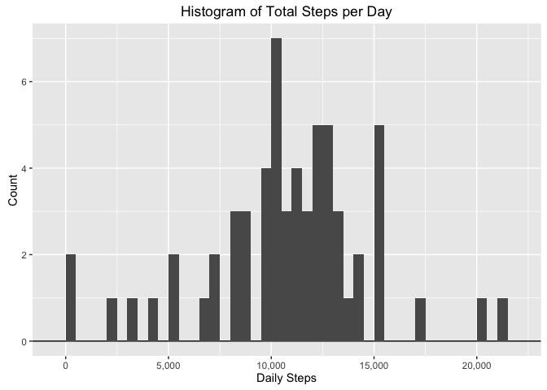
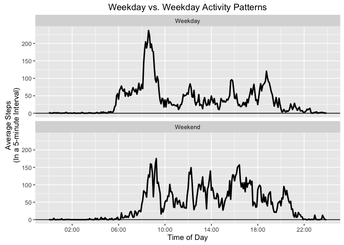

# Reproducible Research: Peer Assessment 1
## Background
This document is designed to satisfy the requirements of the first course project for the Coursera course: Reproducible Reaseach.  The data are provided in the Git repository (history about the repo is available on github.com)


## Loading and preprocessing the data
The first step in any data analysis is to import the data into a clean, usable set.  The data for this project was provided by the instructor and is in this Git repository.  I'm a fan of data.table, so all of the manipulation will be done using a data.table approach.

### Load necessary libraries

```r
library(data.table)
library(lubridate)
library(scales)
library(ggplot2)
```
### Import the data and add a date time column
To visualize the data, it will be useful to have an actual time representation of the interval, so that variable is added to the dataset.

```r
data <- data.table(read.csv(unz('activity.zip', 'activity.csv'), header = TRUE, stringsAsFactors = FALSE))
## chose an arbitrary date portion of the startDate variable
startDate <- as.POSIXct(strptime(paste0(min(data$date), ' 00:00:00', tz = "GMT"), format = '%Y-%m-%d %H:%M:%S'))
data[, clockTime := startDate + hours(interval %/% 100) + minutes(interval %% 100)]
```

## What is mean total number of steps taken per day?
To do this, we have to sum the total number of steps per day and then find the average across days.  This can be done compactly in a single line of code for the mean and median.

```r
mean(data[, .(daily = sum(steps, na.rm = TRUE)), by = date]$daily)
```

```
## [1] 9354.23
```

```r
as.numeric(quantile(data[, .(daily = sum(steps, na.rm = TRUE)), by = date]$daily, 0.5))
```

```
## [1] 10395
```
Then, we can look at the variation in steps across days by looking at a histogram of results.

```r
## summarize the data
daily <- data[, .(steps = sum(steps, na.rm = TRUE)), by = date]
## Plot
ggplot(data = daily, mapping = aes(x = steps)) + geom_hline(yintercept = 0) +
    geom_histogram(stat = 'bin', binwidth = 500) +
    scale_y_continuous("Count") + scale_x_continuous(name = "Daily Steps", labels = comma) +
    ggtitle("Histogram of Total Steps per Day")
```


## What is the average daily activity pattern?
To look at the "average day", we need to find the average number of steps per five minute interval, and then plot that across a day's time.  Then we plot it using ggplot.

```r
averageDay <- data[, .(steps = mean(steps, na.rm = TRUE)), by = clockTime]
## Note that there is a conversion to clockTime to force it to print the labels properly
ggplot(data = averageDay, mapping = aes(x = clockTime - hours(4), y = steps)) + 
    geom_hline(yintercept = 0) +
    geom_line(lwd = 2, col= "steelblue") +
    scale_x_datetime(name = "Time of Day", breaks=date_breaks("4 hour"), labels=date_format("%H:%M")) +
    scale_y_continuous(name = "Average Steps\n(In a 5-minute Interval)") +
    ggtitle("Daily Activity Pattern")
```


Reading the graph carefully, we can see the interval with the most steps.  But we can also run a simple line of code that will show us the same:

```r
format(averageDay[steps == max(averageDay$steps)]$clockTime, "%H:%M:%S")
```

```
## [1] "08:35:00"
```
which can also be verified from our original data set:

```r
data[, .(all = sum(steps, na.rm = TRUE)), by=interval][all == max(all), .(interval)]
```

```
##    interval
## 1:      835
```

## Imputing missing values
We note that from the histogram of Daily Steps, there are 10 days with almost no steps or no steps counted.  This is likely due to data being missing.  From the below, eight days are fully missing:

```r
data[, .(steps = sum(steps, na.rm = TRUE)), by = date][steps == 0, .(.N)]$N
```

```
## [1] 8
```
And the total number of missing data points is:

```r
nrow(data[is.na(steps)])
```

```
## [1] 2304
```
And we can also see that they are the only missing step data points:

```r
data[is.na(steps), .(.N), by = date]
```

```
##          date   N
## 1: 2012-10-01 288
## 2: 2012-10-08 288
## 3: 2012-11-01 288
## 4: 2012-11-04 288
## 5: 2012-11-09 288
## 6: 2012-11-10 288
## 7: 2012-11-14 288
## 8: 2012-11-30 288
```
We can impute missing values using a simple approach to help us better understand what more typical behavior for a person wearing an activity monitor would be.

### Imputation of Data by Day-of-Week
It is reasonable to expect that peoples patterns are affected by which day of the week that it is.  So we will calcualte an average activity pattern by day of week and then assign that pattern to days with missing data.  First, let's check to see if we have enough of each day of week:

```r
unique(data[, .(date) ], by = NULL)[, .(wd = weekdays(as.Date(date)))][, .(.N), by = wd]
```

```
##           wd N
## 1:    Monday 9
## 2:   Tuesday 9
## 3: Wednesday 9
## 4:  Thursday 9
## 5:    Friday 9
## 6:  Saturday 8
## 7:    Sunday 8
```
We have about 9 of each of them.  But are we missing a disproportianate number of one day of the week?  This can be seen here:

```r
unique(data[is.na(steps), .(date) ], by = NULL)[, .(wd = weekdays(as.Date(date)))][, .(.N), by = wd]
```

```
##           wd N
## 1:    Monday 2
## 2:  Thursday 1
## 3:    Sunday 1
## 4:    Friday 2
## 5:  Saturday 1
## 6: Wednesday 1
```
This approach seems reasonably useful given the output to the above.  To implement, we first calculate the average steps by day of week and interval, then merge it to the original data and update the steps where they are missing.  Given that steps are integer, we round the average values before imputing.  Finally, the unnecessary columns (`imputedSteps` and `dayOfWeek`) are dropped from `newData`.

```r
data[, dayOfWeek := weekdays(as.Date(date))]
dayOfWeek <- data[!is.na(steps), .(imputedSteps = mean(steps)), 
                by = list(dayOfWeek = weekdays(as.Date(date)), interval, clockTime)]
newData <- merge(data, dayOfWeek, by = c("dayOfWeek", "interval", "clockTime"))
newData[is.na(steps), steps := as.integer(round(imputedSteps,0))]
newData[, `:=` (imputedSteps = NULL, dayOfWeek = NULL)]
```
To visualize this, a histogram of the total steps per day is useful:

```r
ggplot() + geom_hline(yintercept = 0) +
    geom_histogram(data = newData[, .(steps = sum(steps)), by = date], 
                    mapping = aes(x = steps), stat = 'bin', binwidth = 500) +
    scale_y_continuous("Count") + scale_x_continuous(name = "Daily Steps", labels = comma) +
    ggtitle("Histogram of Total Steps per Day")
```



The primary visual impact has been to eliminate the bar at the 0 to 500 step level.  To see more directly the quantitative impact of this, we will again calculate the mean and median total steps taken per day.

```r
mean(newData[, .(daily = sum(steps, na.rm = TRUE)), by = date]$daily)
```

```
## [1] 10821.1
```

```r
as.numeric(quantile(newData[, .(daily = sum(steps, na.rm = TRUE)), by = date]$daily, 0.5))
```

```
## [1] 11015
```
Referring to above, these values are slightly higher, indicating that the days of the week we imputed are, on average, slightly more active than the other days of the week (there were two Mondays and two Fridays).  Can we directly see this?

```r
dayOfWeek[, .(steps = sum(imputedSteps)), by = dayOfWeek][order(-steps)]
```

```
##    dayOfWeek     steps
## 1:  Saturday 12535.429
## 2:    Friday 12359.714
## 3:    Sunday 12277.714
## 4: Wednesday 11790.750
## 5:    Monday  9974.857
## 6:   Tuesday  8949.556
## 7:  Thursday  8212.750
```
And from that Friday is much more active than other days, on average (and our data set slightly over-represents low activity days like Tuesday).

## Are there differences in activity patterns between weekdays and weekends?
Here we can leverage the previously created `dayOfWeek` variable to see how activity varies, on average, for weekdays versus weekends.

```r
weekendVsWeekday <- rbind(dayOfWeek[substr(dayOfWeek, 1, 1) == "S", .(type = "Weekend", steps = mean(imputedSteps)), by = clockTime ],
                          dayOfWeek[substr(dayOfWeek, 1, 1) != "S", .(type = "Weekday", steps = mean(imputedSteps)), by = clockTime ])
ggplot(data = weekendVsWeekday, mapping = aes(x = clockTime - hours(4), y = steps)) + ## correction to time to plot between 0 and 24 hours
    facet_wrap(~ type, ncol = 1) +
    geom_hline(yintercept = 0) +
    geom_line(lwd = 1) +
    scale_x_datetime(name = "Time of Day", breaks=date_breaks("4 hour"), labels=date_format("%H:%M")) +
    scale_y_continuous(name = "Average Steps\n(In a 5-minute Interval)") +
    ggtitle("Weekday vs. Weekday Activity Patterns")
```



This graph clearly indicates that there is a meaningful difference between weekdays and weekends, though not in the way I had anticipated.  My original hypothesis was that weekends would prove to be far more active across the board.  The graph shows a slightly higher level of activity, but not nearly as pronounced at the pre-work period of around 8am.
